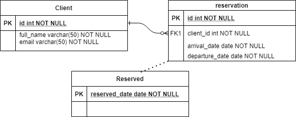

# volcano-campsite

volcano-campsite API is the microservice restful API for volcano campsite reservation.

### Requirement

Please [click link](doc/requirement.md) for detail of business requirement.

### Prerequisites

- JDK 11

- Maven 3.8.1+

- Light4j

#### Backend repository Design

The volcano-campsite API uses H2 database as backend repository to save user and reservation information. As the API is designed to handle one single campsite, the database structure is simple:


| Table   | Comments        |
| --------|---------------|
| client  | Client information including client name and client email |
| reservation  | Reservation detail information. This is the table hold book of records for reservation |
| reserved  | Reserved date. This table is used to handle concurrent requests  |


By default, when the API starts, h2 will start in-memory database testdb and create tables listed above.

```yaml
datasource.H2DataSource:
  DriverClassName: org.h2.jdbcx.JdbcDataSource
  jdbcUrl: jdbc:h2:mem:testdb;INIT=runscript from 'classpath:scripts/schema.sql';
  username: sa
  password: sa
  maximumPoolSize: 2
  connectionTimeout: 1000
```
The data in the database will disappear after API shutdown. In case if we need keep the data, change the url to use file base h2 database:

    url: jdbc:h2:~/testdb

ER-diagram:



H2 console:

There is a startuphook defined to initial H2 DB datasource and enable H2 console

```text
  - com.networknt.server.StartupHookProvider:
    - com.mservicetech.campsite.H2DatasourceStartupHook
```

After the API started, the console will be available on:

http://localhost:8082/ (if the port has been used, change the webPort property on h2 server property file)


Login with user: sa   / password: sa

The startuphook also build DB datasource and verify DB connection. The advantage for this feature is that we can know the DB connection status on API startup instead of wait until first request coming.


##### API Endpoints Design

- Get: /api/campsite           -- List available time for the campsite


- POST: /api/campsite                  --campsite reservation


- Put:  /api/campsite/{orderId}        -- Change reservation by Id and new reservation info


- Delete: /api/campsite/{orderId}      -- Delete reservation by Id

- Get: /api/campsite/{orderId}      -- Get reservation by Id

For the detail, please refer to the openapi spec [here](src/main/resources/config/openapi.yaml).


### Local build

There are several ways to start API:

- From IDE, run com.networknt.server.Server
  

- Start from command line:

```text
cd /workspace/volcano-campsite
mvn clean install
java -jar target/volcano-campsite-1.00.jar
```

Test:

```yaml
curl --location --request GET 'http://localhost:8080/api/campsite?startDate=2021-11-10&endDate=2021-12-18' \
--header 'Content-Type: application/json' \
--header 'requestId: 1' \
--header 'applicationId: 2' \
--data-raw ''
```