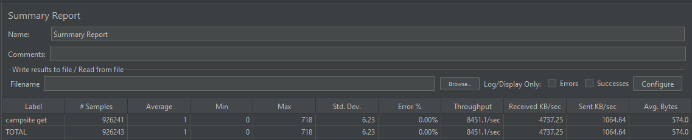
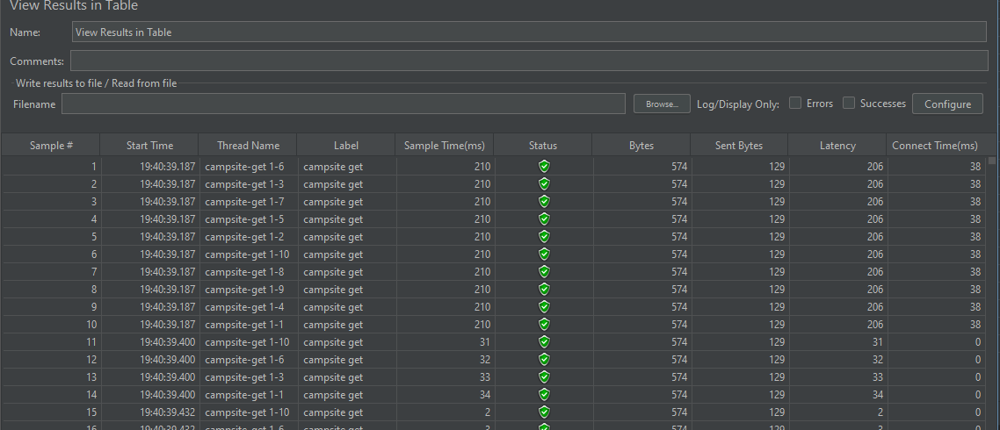
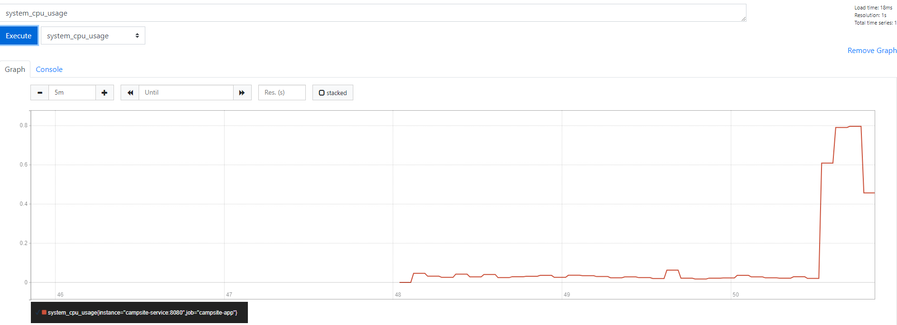

## Volcano campsite microservice API performance document

### jmeter testing

Summary report:



Table result:




### Metrics with Prometheus

API metrics help to understand the operational performance of APIs. It can indicate digital business health and allow businesses to take immediate corrective action if an important app is down. It can help determine which new services are performing well and which aren’t.


Prometheus is an open-source monitoring system that was originally built by SoundCloud. It consists of the following core components:

A data scraper that pulls metrics data over HTTP periodically at a configured interval.

A time-series database to store all the metrics data.

A simple user interface where you can visualize, query, and monitor all the metrics.

- In the volcano campsite, it enabled spring boot micrometer-registry-prometheus dependency:

```yaml
<dependency>
<groupId>io.micrometer</groupId>
<artifactId>micrometer-registry-prometheus</artifactId>
</dependency>
```

Spring Boot  automatically configure a PrometheusMeterRegistry and a CollectorRegistry to collect and export metrics data in a format that can be scraped by a Prometheus server.

URL: http://localhost:8080/actuator/prometheus

Below are the downloaded prometheus report:

```yaml
jvm_gc_pause_seconds_count{action="end of minor GC",cause="Metadata GC Threshold"} 1.0
jvm_gc_pause_seconds_sum{action="end of minor GC",cause="Metadata GC Threshold"} 0.012
jvm_gc_pause_seconds_count{action="end of minor GC",cause="G1 Evacuation Pause"} 1.0
jvm_gc_pause_seconds_sum{action="end of minor GC",cause="G1 Evacuation Pause"} 0.012
# TYPE jvm_gc_pause_seconds_max gauge
# HELP jvm_gc_pause_seconds_max Time spent in GC pause
jvm_gc_pause_seconds_max{action="end of minor GC",cause="Metadata GC Threshold"} 0.012
jvm_gc_pause_seconds_max{action="end of minor GC",cause="G1 Evacuation Pause"} 0.012
# TYPE jvm_threads_daemon_threads gauge
# HELP jvm_threads_daemon_threads The current number of live daemon threads
jvm_threads_daemon_threads 15.0
# TYPE hikaricp_connections_pending gauge
# HELP hikaricp_connections_pending Pending threads
hikaricp_connections_pending{pool="HikariPool-1"} 0.0
# TYPE jdbc_connections_idle gauge
# HELP jdbc_connections_idle Number of established but idle connections.
jdbc_connections_idle{name="dataSource"} 10.0
# TYPE hikaricp_connections_creation_seconds_max gauge
# HELP hikaricp_connections_creation_seconds_max Connection creation time
hikaricp_connections_creation_seconds_max{pool="HikariPool-1"} 0.0
# TYPE hikaricp_connections_creation_seconds summary
# HELP hikaricp_connections_creation_seconds Connection creation time
hikaricp_connections_creation_seconds_count{pool="HikariPool-1"} 0.0
hikaricp_connections_creation_seconds_sum{pool="HikariPool-1"} 0.0
# TYPE jvm_memory_committed_bytes gauge
# HELP jvm_memory_committed_bytes The amount of memory in bytes that is committed for the Java virtual machine to use
jvm_memory_committed_bytes{area="nonheap",id="CodeHeap 'profiled nmethods'"} 1.3828096E7
jvm_memory_committed_bytes{area="heap",id="G1 Survivor Space"} 1.572864E7
jvm_memory_committed_bytes{area="heap",id="G1 Old Gen"} 1.47849216E8
jvm_memory_committed_bytes{area="nonheap",id="Metaspace"} 7.3261056E7
jvm_memory_committed_bytes{area="nonheap",id="CodeHeap 'non-nmethods'"} 2555904.0
jvm_memory_committed_bytes{area="heap",id="G1 Eden Space"} 2.36978176E8
jvm_memory_committed_bytes{area="nonheap",id="Compressed Class Space"} 9822208.0
jvm_memory_committed_bytes{area="nonheap",id="CodeHeap 'non-profiled nmethods'"} 4587520.0
```

-  Setting up Prometheus and importing the metric:

From API root folder start Prometheus docker-compose:

```yaml
docker-compose -f   docker-compose-prometheus.yml up
```
The docker-compose will start three docker images:

- campsite service will start on port 8080

- Prometheus will start on 9090 port:
  
  http://localhost:9090/

- grafana start on 3000 port

We can start to run jmeter test and monitor the API by prometheus metrics.

For Example: CPU usage:



